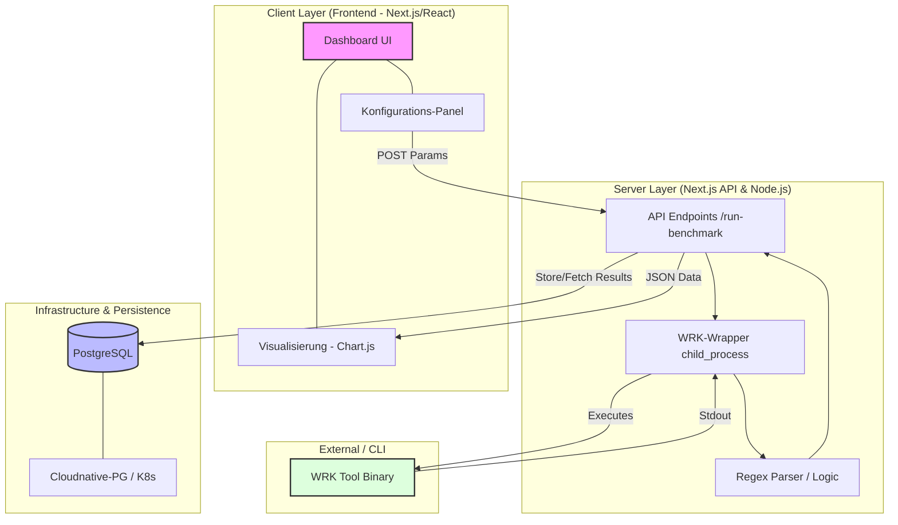
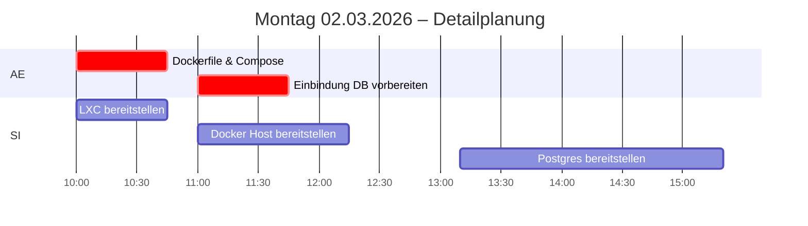
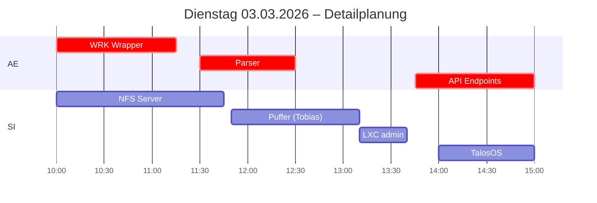
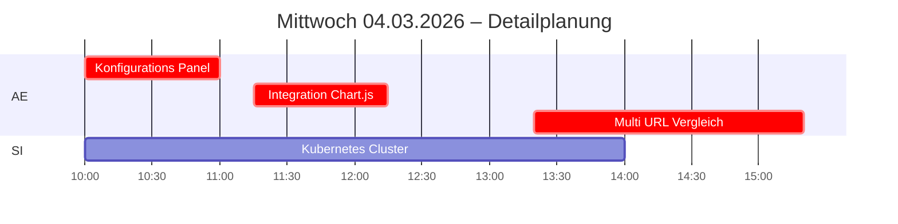
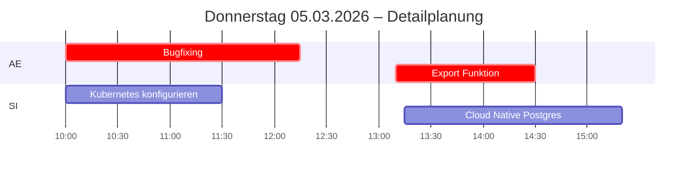

# Pflichtenheft: WRK-Visualizer Dashboard
**Projekt:** Visuelle Oberfläche für das WRK-Benchmarking-Tool  
**Teams:**   
          - Team (AE): Nico, Oskar  
          - Team (SI): Tobias, Ricardo  
**Version:** 1.0  
**Datum:** 27.02.2026
**Status:** In Bearbeitung  

---

## 1. Zielbestimmung
Das Projekt "WRK-Visualizer" soll eine benutzerfreundliche Web-Oberfläche (Dashboard) bieten, um das CLI-Tool `wrk` zu steuern und dessen Ergebnisse grafisch aufzubereiten.

### 1.1 Muss-Ziele
* Durchführung von Benchmarks gegen mehrere URLs.
* Visualisierung von RPS, Throughput, Latenz und Ping.
* Speicherung der Ergebnisse in einer PostgreSQL-Datenbank.
* Containerisierung der gesamten Anwendung (Docker).

### 1.2 Wunsch-Ziele
* Keine Einschränkung der Performance durch Frontend / Wrapper
* Anschauliche Frontend mit Tailwind.css gestalten
* Export in verschiedenen Formaten (JSON/PDF)

### 1.3 Funktionale Anforderungen (AE)

* next.js framework auf Webserver einrichten
* Datenbank einbinden
* Dashboard implementieren
* Befehlsausführung auf Dashboard einrichten
* API-Einbindung
* Unit-Test für Ausführung und Berechnung von Metriken
* Integration Test für die Nutzung des Dashboards

### 1.4 Funktionale Anforderungen (SI)

* Docker Host bereitstellen
* Datenbank bereitstellen (PostgresSQL)
* Proxmox bereitstellen
* Linux Container (Debian 13) bereitstellen
* Linux Container (Webserver) bereitstellen
* Netzwerktechnik überprüfen
* Optional:
  * Kubernetes Stack
  * VPN Consultant
  * Docker-Host für anderes Team zur Verfügung stellen
---

## 2. Produkteinsatz
### 2.1 Anwendungsbereiche
Das Tool dient der Performance-Analyse von Web-Services während der Entwicklungs- und Testphase.

### 2.2 Zielgruppen
Entwickler, DevOps-Engineers in Unternehmen die Bedarf für eine einfaches anschauliches Tool zum Benchmarking und Monitoring haben.

### 2.3 Betriebsbedingungen
* Lauffähig in Docker-Umgebungen (Containerisierung)
* Orchestrierung via Kubernetes (Cloudnative-PG)

---

## 3. Produktfunktionen (Funktionale Anforderungen)
* **F10:** Starten eines WRK-Benchmarks über die Weboberfläche
* **F20:** Eingabe von Parametern (Dauer, Threads, Connections)
* **F30:** Echtzeit- oder Post-Benchmark-Visualisierung der Daten
* **F40:** Vergleichsansicht für mehrere Ziel-URLs
* **F50:** Persistente Speicherung der Testläufe

---

## 4. Produktdaten (Nicht-funktionale Anforderungen)
* **NF10 (Performance):** Die UI darf während des Benchmarks nicht blockieren.
* **NF20 (Skalierbarkeit):** Unterstützung für Kubernetes-Deployment (Datenbank).
* **NF30 (Usability):** Intuitive Bedienung des Dashboards ohne CLI-Kenntnisse.

---

## 5. Systemarchitektur & Schnittstellen
### 5.1 Software-Architektur
* **Frontend:** Next.js (React)
* **Backend:** Next.js API Routes / Node.js
* **Datenbank:** PostgreSQL

UML-Diagram:

### 5.2 Externe Schnittstellen
* **Cloudnative-PG:** Schnittstelle zur Datenbank-Orchestrierung.

---
## Ressourcenplanung
Zeitplanung:
  - Stand-Up 9:45
  - Sprint Review/Planung: 12:55

Teilaufgaben (AE):

Phase 1: Vorbereitung & Setup (Freitag)

    T1.1: Anforderungsanalyse finalisieren & User Stories definieren. (2h)

    T1.2: Lokale Entwicklungsumgebung mit wrk Installation aufsetzen. (0.5h)

    T1.3: Initialisierung des Next.js Projekts mit TypeScript und Tailwind CSS. (0.5h)

Phase 2: Infrastruktur & Daten (Montag)

    T2.1: Dockerisierung der Next.js App (Dockerfile & Compose). (0.5h)

    T2.2: Datenbank-Schema-Design (Einbindung) (Tabellen für Benchmarks, Results und Parameters). (0.5h)

Phase 3: Core-Logik & Backend (Dienstag)

    T3.1: Entwicklung des WRK-Wrappers (Node.js child_process Anbindung). (1h)

    T3.2: Parser-Logik schreiben, um CLI-Text-Output in JSON-Objekte zu konvertieren. (1h)

    T3.3: API-Endpoints erstellen (POST /run-benchmark, GET /results). (1.5h)

Phase 4: Frontend & Visualisierung (Mittwoch)

    T4.1: Entwicklung des Konfigurations-Panels (Formulareingabe für URLs/Parameter). (1h)

    T4.2: Integration von Chart.js/Recharts zur Darstellung der Latenz und RPS. (1h)

    T4.3: Implementierung der Vergleichsansicht (Multi-URL Vergleich). (2h)

Phase 5: Refinement & Präsentation (Donnerstag - Freitag)

    T5.1: Bugfixing & Performance-Optimierung (Non-blocking UI Check). (2h)

    T5.2: Export-Funktion implementieren (JSON Download). (1h)

    T5.3: Erstellung der Projektdokumentation und Diagramme für die Abgabe. (2h)

Teilaufgaben (SI):

Phase 1: Freitag

    T1.1: Proxmox Updaten und mögliche Fehler beheben (1,5h)  

    T1.2: Netzwerktechnik überprüfen (1,5h)
    
Phase 2: Montag

    T2.1: LXC bereitstellen (0,5h)

    T2.2: Docker Host bereitstellen (1h)

    T2.3: Postgres Datenbank bereitstellen (2h)

Phase 3: Dienstag

    T3.1: NFS Server bereitstellen (2h)

    T3.2: LXC (admin) für Kubernetes bereitstellen (0,5)

    T3.3: TalosOS herunterladen und VM-fähig machen (1h)
    
Phase 4: Mittwoch

    T4.1: Kubernetes Cluster konfigurieren (3,5h)
    
Phase 5: Donnerstag 

    T5.1: Kubernetes Cluster konfigurieren (1,5h)

    T5.2: Cloud Nativ Postgres Deployen (2h)

    
Gantt-Diagram:

---

## 6. Benutzeroberfläche (UI-Design)
* [ ] **Dashboard-Ansicht:** Liste der aktiven/vergangenen Tests.
* [ ] **Konfigurations-Panel:** Formular für URL-Eingabe und Header-Einstellungen (Methoden).
* [ ] **Analyse-View:** Charts (z.B. Chart.js oder Recharts) für Latenzverteilung.

---

## 7. Qualitätsanforderungen
| Qualitätsmerkmal | Sehr hoch | Hoch | Relevant | Begründung |
| :--- | :---: | :---: | :---: | :--- |
| **Zuverlässigkeit** | X | | | Da das Tool Lasttests durchführt, müssen die Ergebnisse präzise und reproduzierbar sein. Systemausfälle während einer Messung würden die Validität der Benchmarks zerstören. |
| **Benutzbarkeit** | | X | | Das Frontend soll die Komplexität der `wrk`-CLI abstrahieren. Eine intuitive Bedienung ist entscheidend, damit Nutzer Tests ohne tiefgreifende Terminal-Kenntnisse konfigurieren können. |
| **Performance** | X | | | Das Tool darf selbst keinen Overhead erzeugen. Die Web-UI muss in der Lage sein, die hohen Datenraten von `wrk` in Echtzeit zu visualisieren, ohne den Test-Host zu belasten. |
| **Wartbarkeit** | | X | | Der modulare Aufbau ist wichtig, um auf Änderungen in der `wrk`-Basis reagieren zu können oder neue Analyse-Features (wie den Export von Reports) leicht zu integrieren. |

---

## 8. Abnahmekriterien
* Der Benchmark startet erfolgreich über einen Button-Klick.
* Daten werden korrekt aus dem WRK-Output geparst.
* Die Ergebnisse sind nach einem Refresh der Seite in der Historie sichtbar.

---

## 9. Glossar
* **WRK:** Ein modernes HTTP-Benchmarking-Tool.
* **RPS:** Requests per Second.
* **Cloudnative-PG:** Kubernetes-Operator für PostgreSQL.

## 10. Techstack

| Ebene | Komponente | Zweck | Hinweise / Plugins / Tools |
| :--- | :--- | :--- | :--- |
| **Frontend** | Dashboard & UI | Visualisierung von Metriken (RPS, Latenz) und Steuerung der Tests. | Next.js, Tailwind CSS, Chart.js / Recharts |
| **Frontend** | Konfigurations-Panel | Eingabemaske für Benchmark-Parameter (URL, Threads, Dauer). | React Forms, Validierung |
| **Backend / API** | Next.js API Routes | Schnittstelle zwischen UI und Logik; Handling von Testanfragen. | Node.js, TypeScript |
| **Backend / Logic** | WRK-Wrapper | Ausführung des CLI-Tools und Umwandlung von Text-Output in Daten. | Child_process, Regex Parser |
| **Datenbank** | PostgreSQL | Persistente Speicherung von Testergebnissen, Parametern und Historie. | Cloudnative-PG, Prisma/Drizzle (optional) |
| **Infrastruktur** | Docker-Umgebung | Containerisierung der Applikation für konsistente Ausführung. | Docker, Docker Compose |
| **Infrastruktur** | Proxmox / LXC | Bereitstellung der virtuellen Host-Umgebung und Server. | Debian 13, Linux Container |
| **Orchestrierung** | Kubernetes | Skalierbarer Betrieb und Management der Datenbank/Anwendung. | K8s Stack, TalosOS, NFS Server |
| **Qualitätssicherung** | Test-Suite | Sicherstellung der korrekten Berechnung und UI-Funktion. | Unit-Tests, Integration-Tests |
